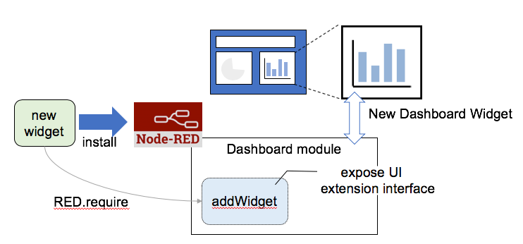

# API for Creating Node-RED Dashboard Widgets

Currently, Node-RED Dashboard do not officially allow installing user defined widget nodes.  However, making a mechanism for installing new widget node is desirable because it  

This document describes Node-RED extension for creating new dashboard widget node because it enriches Node-RED Dashboard ecosystem as established by current Node-RED nodes.

## Creating Widget Node

- Basic node code (HTML, JavaScript, package.json, …) structure is basically same as normal node definition.

- Dashboard module (node-red-module) exposes an API for defining new widgets.

  - API of Dashboard module is loaded by widget module using `RED.require` runtime API instead of standard `require` call in order to resolve problems on module installation path.

  

## API for Widget Definition

To support new widget, following runtime API is exported from Dashboard module:

- `addWidget(`*options*`)`

  *options* is an JavaScript object that can contain following properties:

  | #    | name[* - optional]         | description                                                  |
  | :--- | :------------------------- | :----------------------------------------------------------- |
  | 1    | node*                      | controlling node.<br/>optional if scope is "global".                                             |
  | 2    | format                     | HTML code of widget.<br />Accepts HTML same as one for Template Dashboard widget node. |
  | 3    | group                      | group node object to which widget belongs                    |
  | 4    | width*                     | width of widget                                              |
  | 5    | height*                    | height of widget                                             |
  | 6    | templateScope              | scope of widget ("global" or "local")                        |
  | 7    | emitOnlyNewValues*         | send message if changed                                      |
  | 8    | forwardInputMessages*      | forward input messages to output                             |
  | 9    | storeFrontEndInputAsState* | store received message                                       |
  | 10   | convert*                   | callback to convert value to front-end                       |
  | 11   | beforeEmit*                | callback to prepare message                                  |
  | 12   | convertBack*               | callback to convert sent message                             |
  | 13   | beforeSend*                | callback to prepare message                                  |
  | 14   | order                      | order in group                                               |
  | 15   | initController*            | callback to initialize in controller                         |

  `addWidget` returns a callback that should be called on close of controlling node.

  ## Typical Node Code Structure

  ### HTML code

  - Same as notmal node described at (https://nodered.org/docs/creating-nodes/node-html).  

  - Should provide interface for setting group node.

    **Example:**

    - Node settings UI:
      - group: belonging group
      - size: size of widget
      - name: name of widget

      ```html
      <script type="text/x-red" data-template-name="ui_cal">
          <div class="form-row" id="template-row-group">
             <label for="node-input-group"><i class="fa fa-table"></i> Group</label>
             <input type="text" id="node-input-group">
          </div>
          <div class="form-row" id="template-row-size">
              <label><i class="fa fa-object-group"></i> Size</label>
              <input type="hidden" id="node-input-width">
              <input type="hidden" id="node-input-height">
              <button class="editor-button" id="node-input-size"></button>
          </div>
          <div class="form-row">
              <label for="node-input-name"><i class="fa fa-tag"></i> Name</label>
              <input type="text" id="node-input-name">
          </div>
      </script>
      ```

    - Info text:

      ```
      <script type="text/x-red" data-help-name="ui_cal">
          <p>Sample Widget</p>
      </script>
      ```

    - Type Initialization

      ```
      <script type="text/javascript">
          function mk_conf(NAME) {
      
              var ICON = "icon.png";
      
              var conf = {
                  category: 'dashboard',
                  color: 'rgb( 63, 173, 181)',
                  defaults: {
                      group: {type: 'ui_group', required:false},
                      name: {value: ''},
                      order: {value: 0},
                      width: {
                          value: 0,
                          validate: function(v) {
                              var valid = true
                              var width = v||0;
                              var currentGroup = $('#node-input-group').val()|| this.group;
                              var groupNode = RED.nodes.node(currentGroup);
                              valid = !groupNode || +width <= +groupNode.width;
                              $("#node-input-size").toggleClass("input-error",!valid);
                              return valid;
                          }},
                      height: {value: 0}
                  },
                  inputs:1,
                  outputs:1,
                  icon: ICON,
                  paletteLabel: NAME,
                  label: function() { return this.name || NAME; },
                  oneditprepare: function() {
                      $("#node-input-size").elementSizer({
                          width: "#node-input-width",
                          height: "#node-input-height",
                          group: "#node-input-group"
                      });
                  },
                  oneditsave: function() {
                  },
                  oneditresize: function(size) {
                  }
              };
              return conf;
          };
      
          RED.nodes.registerType('ui_cal', mk_conf('cal'));
      </script>
      ```


  ### JavaScript code

  - load Dashboard module using `RED.require` runtime API.
  - call `addWidget` API in order to define widget.

  ```
  module.exports = function(RED) {
      // define HTML code
      var HTML = String.raw`
  <md-calendar
       ng-model="value"
       ng-change="click(value)"
       aria-label="{{label}}"
       style="z-index:1">
  </md-calendar>
  `;
  
      var ui = undefined;
      function CalNode(config) {
          try {
              var node = this;
              if(ui === undefined) {
                  // load Dashboard API
                  ui = RED.require("node-red-dashboard")(RED);
              }
              RED.nodes.createNode(this, config);
              // create new widget
              var done = ui.addWidget({
                  node: node,
                  format: HTML,
                  templateScope: "local",
                  group: config.group,
                  emitOnlyNewValues: false,
                  forwardInputMessages: false,
                  storeFrontEndInputAsState: false,
                  convertBack: function (value) {
                      return value;
                  },
                  // needs beforeSend to message contents to be sent back to runtime 
                  beforeSend: function (msg, orig) {
                      if (orig) {
                          return orig.msg;
                      }
                  },
                  // initialize angular scope object
                  initController: function($scope, events) {
                      $scope.value = false;
                      $scope.click = function (val) {
                          $scope.send({payload: val});
                      };
                  }
              });
          }
          catch (e) {
              console.log(e);
          }
          node.on("close", done);
      }
      RED.nodes.registerType('ui_cal', CalNode);
  };
  ```
